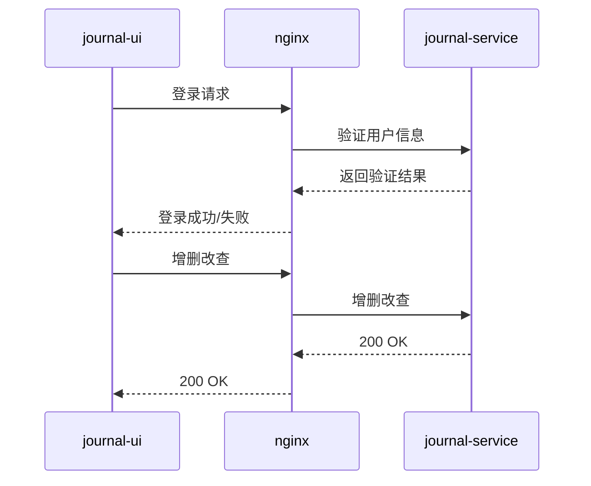

# journal-ui

日记管理系统前端，基于 [Vue 3](https://vuejs.org/) + [Vite](https://vite.dev/) + [Vditor](https://github.com/Vanessa219/vditor) Markdown 编辑器，对接 `journal-service` REST API。

## 功能

- 登录 / 登出（JWT，会话保存在 `sessionStorage`）
- 日记列表与编辑（标题、Markdown 正文、日期、心情、标签、置顶）
- 侧边栏筛选（关键词、标签、心情、近 7/30 天）
- 自动保存与手动保存（`Cmd/Ctrl + S`）
- 统计概览（本月篇数、平均字数、常用标签）
- 明暗主题切换（偏好保存在 `localStorage`）



## 快速开始

### 1. 启动后端

请先按 [journal-service/README.md](../journal-service/README.md) 启动 MySQL 与 API 服务（默认 `http://127.0.0.1:8080`）。

演示账号：`871240671@qq.com` / `123456`

### 2. 安装依赖

```bash
cd journal-ui
yarn
```

### 3. 配置环境变量

```bash
cp .env.example .env   # 首次
```

在 `.env` 中设置后端地址：

```env
VITE_API_BASE=http://127.0.0.1:8080
```

后端 `etc/journal.yaml` 的 `Cors.AllowOrigins` 已放行 `5173`，直连后端即可，无需 Vite 代理。

### 4. 启动开发服务器

```bash
yarn dev
```

默认访问：`http://localhost:5173/journal-ui/`

## 构建与部署

```bash
yarn build
```

产物输出到 `dist/`。项目配置了 `base: '/journal-ui/'`，部署时需将静态资源挂载在该路径下（或按需修改 `vite.config.js` 中的 `base`）。

生产环境 API 地址在 `.env.production` 中配置：

```env
VITE_API_BASE=https://api.example.com
```

本地预览构建结果：

```bash
yarn preview
```

## 环境变量

| 变量 | 说明 |
|------|------|
| `VITE_API_BASE` | 后端 API 基础地址。开发环境填 `http://127.0.0.1:8080`；留空则请求相对路径 `/api/...`（需自行配置反向代理） |

## 目录结构

```
src/
  api/client.js      # 封装 fetch，对接 journal-service API
  auth.js            # 登录态常量（re-export storage）
  storage.js         # sessionStorage / localStorage 键名与迁移
  router/index.js    # 路由与鉴权守卫
  views/
    LoginView.vue    # 登录页
    JournalApp.vue   # 主界面（列表、编辑器、统计）
  App.vue
  main.js
.env.example         # 环境变量示例
vite.config.js       # Vite 配置（base、插件等）
```

## 路由

| 路径 | 说明 |
|------|------|
| `/` | 日记主界面（需登录） |
| `/login` | 登录页 |

## 相关项目

- 后端 API：[journal-service](../journal-service/README.md)
